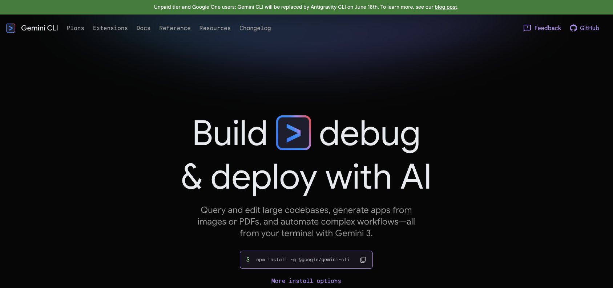

geminicli.com 을 방문해보면 상단에 `Unpaid tier and Google One users: Gemini CLI will be replaced by Antigravity CLI on June 18th. To learn more, see our blog post.` 라는 문구와함께 Gemini CLI 는 6월 18일 부터 Antigravity CLI 로 대체된다는 안내가 나옵니다.

 

이에 따라 gemini cli 번역 문서는 추후 Antigravity IDE 공식문서가 출시되는 것에 따라 해당 내용들을 Antigravity IDE 버전의 문서를 새로운 디렉터리에서 새로 작업을 할 예정입니다. 

참고: https://developers.googleblog.com/an-important-update-transitioning-gemini-cli-to-antigravity-cli/ (An important update: Transitioning Gemini CLI to Antigravity CLI)

