Antigravity 의 새 버전이 3일 전 쯤? 5월 22일쯤 나왔고, Antigravity 의 이전 버전을 사용하던 중 '뭐지? 왜 Codex 로 바뀌었지? IDE 는 이제 VS Code 써야 하나?' 했는데 알고보니 4가지의 제품 라인업으로 분류된 것이었습니다.

- Antigravity 2.0 : Codex 처럼 Agent AI 기반의 메뉴
- Antigravity CLI : Gemini CLI 와 유사한 기능입니다. Gemini CLI 보다 Antigravity 의 AI 프롬프팅이 내부적으로 정교하게 가공된 느낌을 받았었는데, CLI로도 Antigravity 의 프롬프팅을 따로 사용할수 있게 되었습니다.
- Antigravity SDK : 이 부분에 대해서는 아직 아는 내용이 많지는 않지만, Agent 기반의 어떤 기능을 개발할때 유용해질 것 같습니다.
- Antigravity IDE : 예전에 우리가 사용하던 Antigravity 는 Antigravity IDE 라는 이름으로 전환되었고, terminal 에서는 `antigravity {디렉터리명}` 대신 `agy-ide {디렉터리명}` 을 통해 사용할수 있더군요!!

 

Antigravity 공식 홈페이지 접속 후 `Product > See Overview` 를 클릭하면 https://antigravity.google/product 으로 이동되며 다음과 같은 화면들이 나타납니다.

먼저 다음과 같이 Antigravity 2.0, Antigravity CLI, Antigravity SDK 로 여러가지 라인업이 생긴것을 볼수 있습니다.
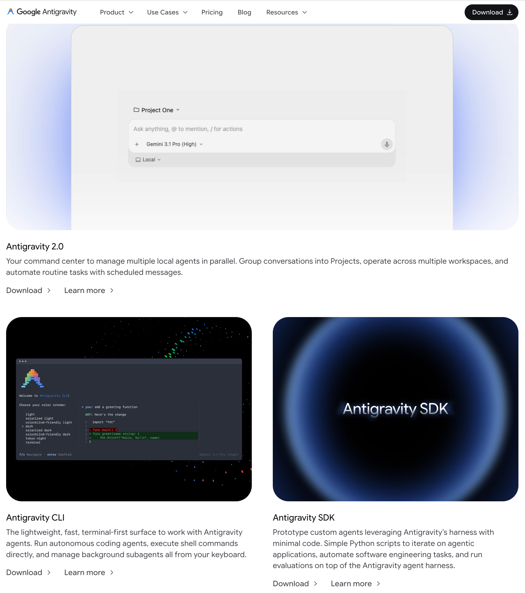
 

Antigravity IDE 도 새로 생긴 것을 볼수 있습니다.
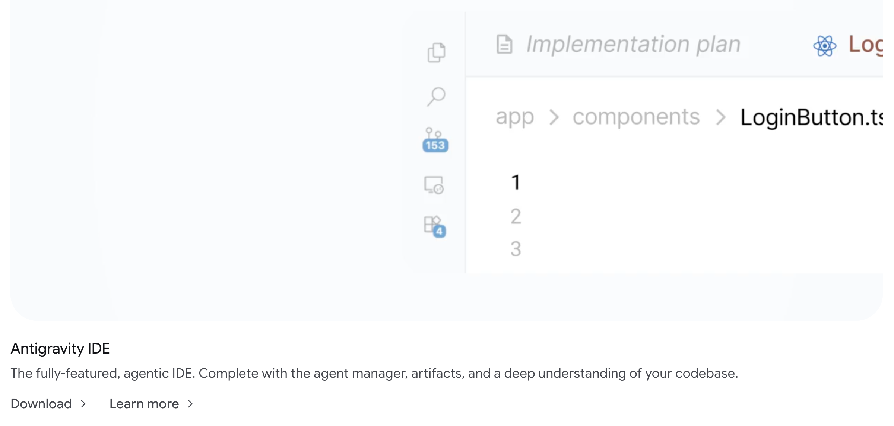

 

각 요소들의 설치는 https://antigravity.google/download 에서 스크롤을 내리면서 원하는 것을 선택해서 설치하면 됩니다. 
 

## Antigravity IDE 설치 과정
제품 소개 페이지에서 `Download` 버튼을 눌러서 dmg 파일을 다운받은 후 설치합니다.

 

Antigravity IDE 를 설치해보다보면 `Solarized Dark` 테마도 보이네요. 나만 이 `theme` 을 몰랐나봅니다.
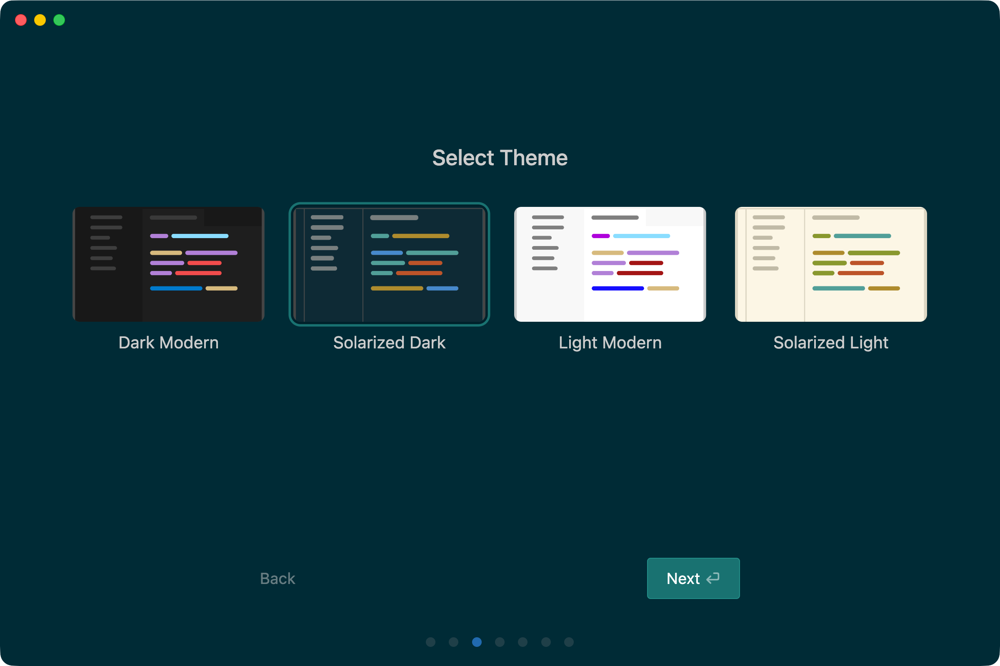

 

어떤 모드를 선택할지 선태갛는데, 제 경우에는 Review driven 을 선택했습니다.
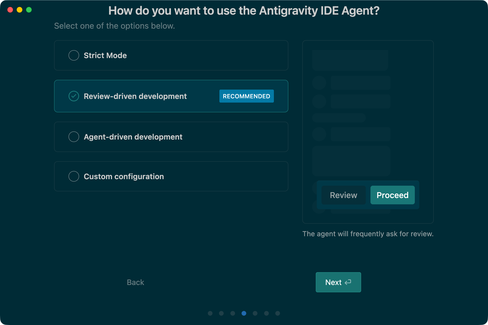

 

Keybinding, Extension 들에 대해 선택하고 Antigravity IDE CLI 를 설치할지를 선택합니다(터미널에서 Antigravity IDE를 실행할 수 있는 CLI 를 설치하는 기능). Antigravity IDE 를 터미널에서 어떻게 실행하는지를 몰라서 어떻게 해야 하나? 했는데 초기 설치 시에 추가할수도 있는 거였네요. 설치를 안했다고 해도 뭐 나중에 Extension 으로도 설치할 수 있겠네요.

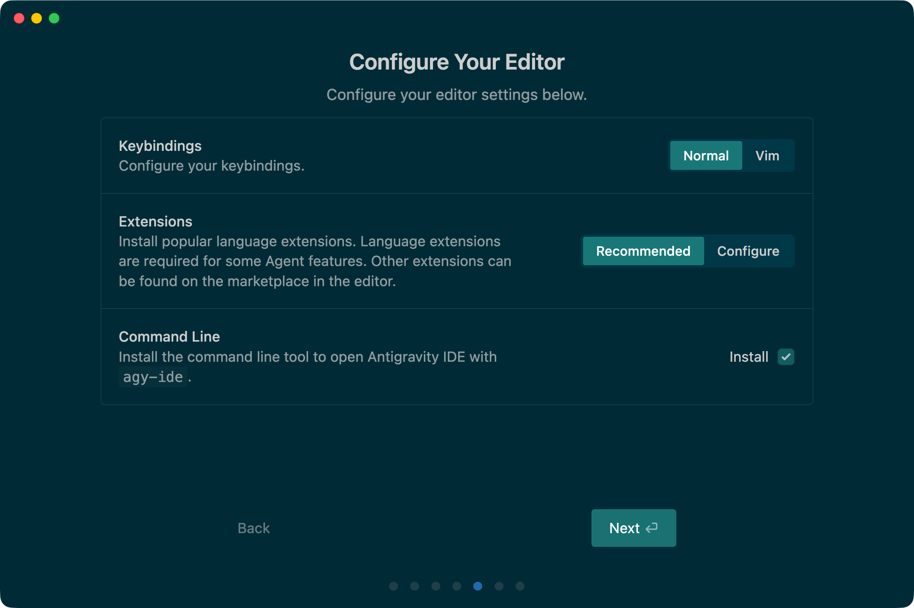

 

다음은 skill 과 MCP 들을 어떤 패키지들을 설치할지를 선택하는 메뉴입니다. 저는 `Science` 빼고 모두 선택했습니다. 
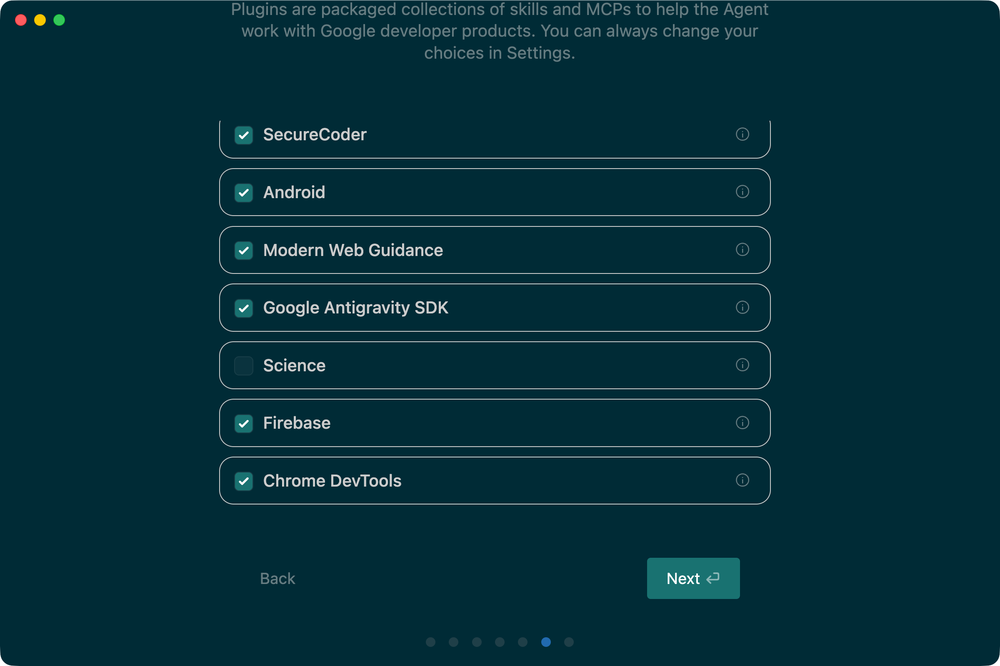

 

그 다음은 약관 동의 화면인데 중요하지 않아서 뺐습니다. 첫번째 항목 동의 안하면 다음으로 못넘어감....

 

## Antigravity CLI
Angravity CLI 섹션 내의 Download 버튼을 클릭합니다.

 

그러면 Antigravity CLI 화면으로 이동되는데요. 사실 https://antigravity.google/download 페이지 내에서 스크롤을 내리면 나타나는 섹션이었네요.
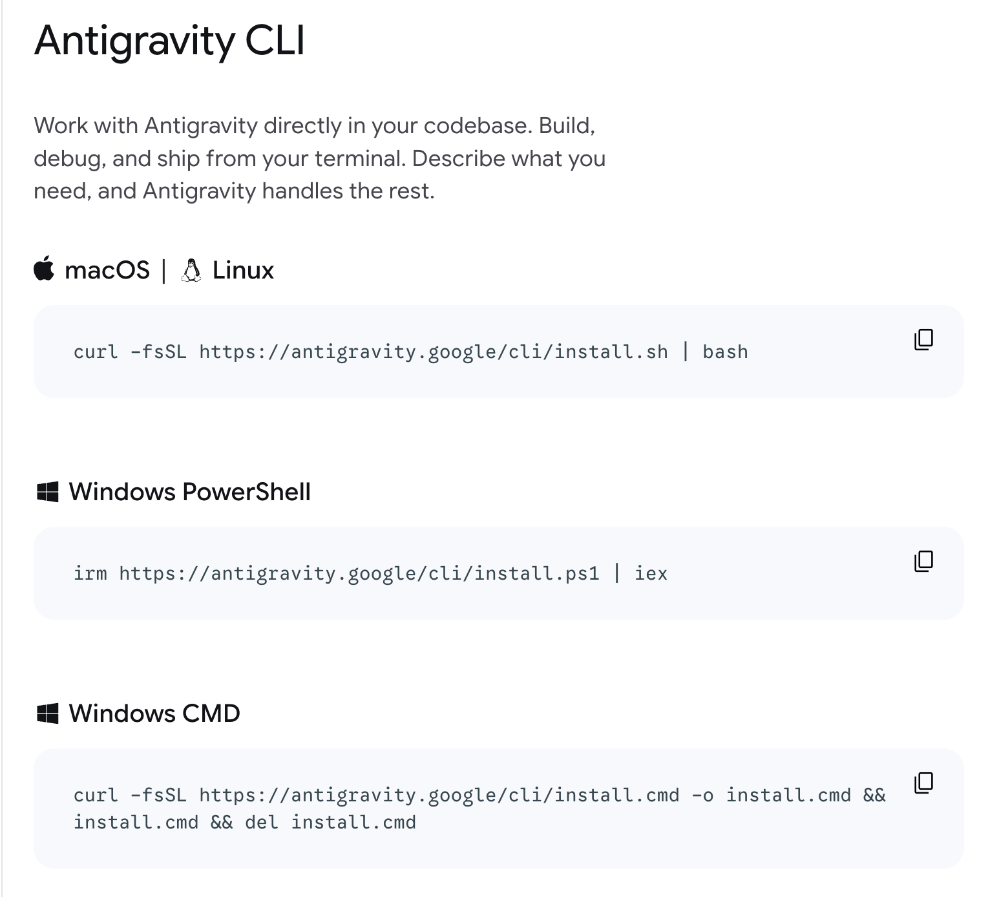
 

안내해주는 명령어를 실행하면 다음과 같이 설치됩니다.
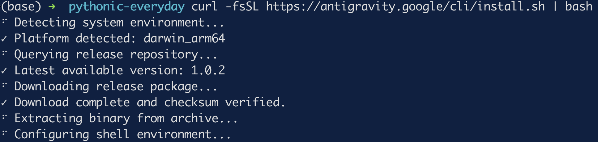
 

실행은 `agy` 명령을 수행하면 된다고 하네요.
 

`agy` 명령을 수행하면 역시 또 설정화면이 나타납니다.
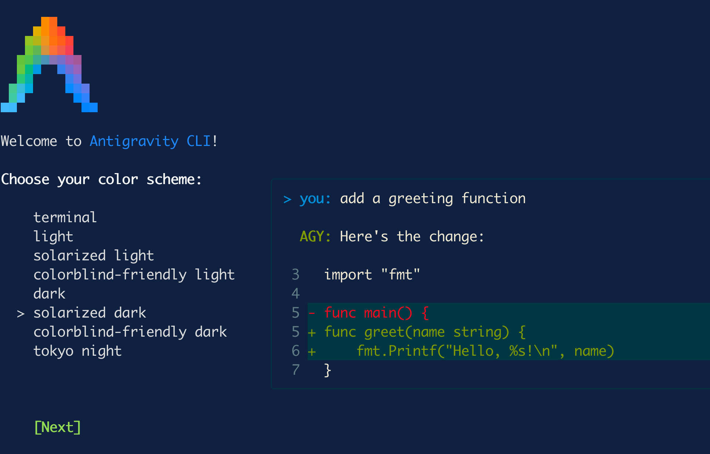
 

약관 동의 화면인데 걍 엔터 눌렀습니다. 터미널 스크롤을 내려야 버튼이 보이는 버그가 있습니다.
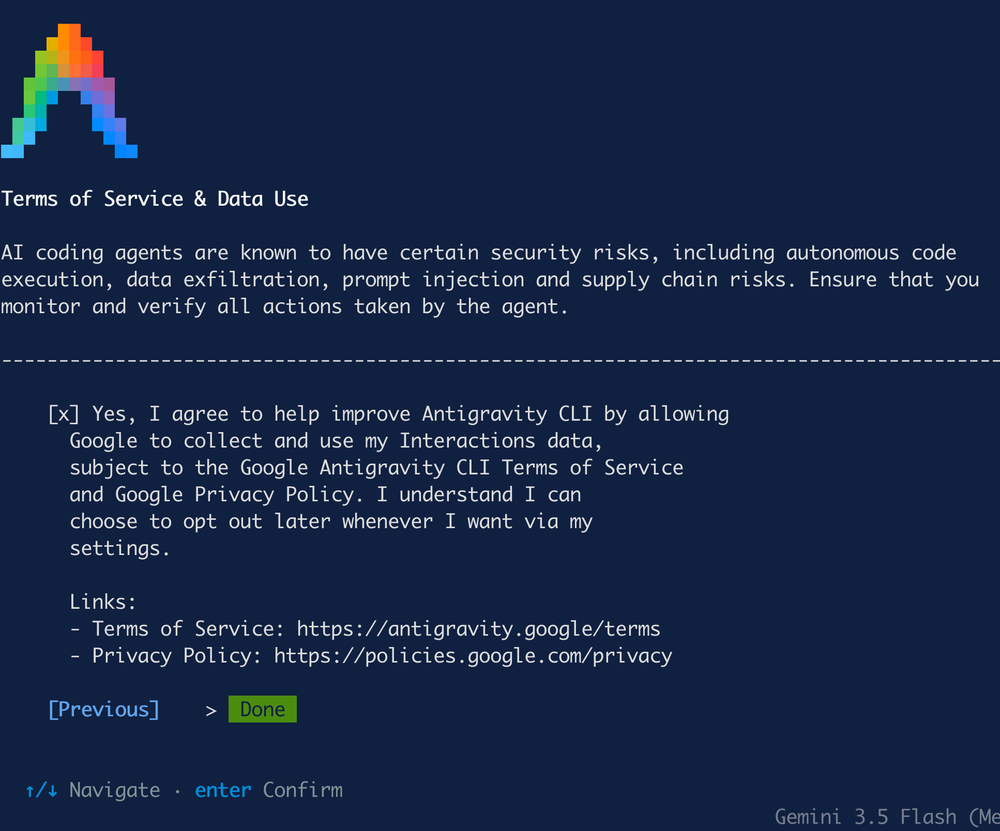
 

다음은 현재 디렉터리를 신뢰할지를 묻는데, Yes 를 선택하면 됩니다.
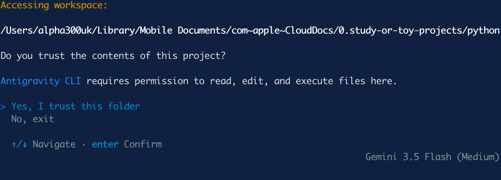

다음은 설정이 모두 완료된 후의 모습입니다.
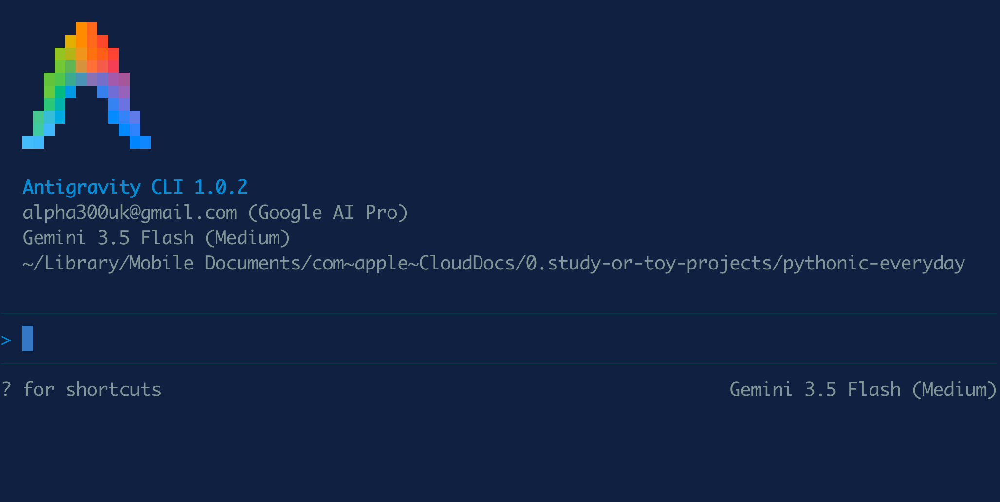